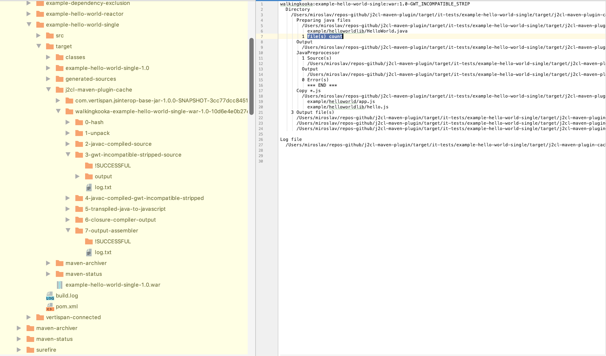

[](https://travis-ci.com/mP1/j2cl-maven-plugin.svg.svg?branch=master)
[](https://opensource.org/licenses/Apache-2.0)

J2CL Maven plugin
=================

This plugin is a rewrite of code present in

    https://github.com/Vertispan/j2clmavenplugin
    
For a full list of contributors, read source and to more click [here](https://github.com/Vertispan/j2clmavenplugin/commits/master)    

A major difference between the two is this plugin requires most parameters and dependencies to be declared as Maven
artifacts, nothing is assumed, everything must be declared in the pom in some form. As much as possible nothing is
defaulted and must be present in the POM.


# Usage

The preferred way to use the plugin is to checkout the source

```
git clone git://github.com/mP1/j2cl-maven-plugin.git
```

and build and install with Maven.

```
mvn clean install
```


# Goals

The plugin supports three out of the four following goals

1. `build`: executes a single compilation, typically to produce a JS application or library.

2. `clean`: cleans up all the cache directory.

3. `test`: executes junit 3 tests.

4. 'watch': aka DEVMODE TODO

Some pieces of the `vertispan/j2clmavenplugin` are currently missing:

- DevMode: Should not be too hard to watch the source directory and re-build.


# Super sourcing

When necessary to emulate missing JRE classes or replace with a browser substitute, super source java files should be
placed place in a projects `resources/super`. Any java files under `/super` will be excluded from any of java compiling (javac). 

Java 9 and later will fail to compile any source under package java, thus they must be excluded using the `/super`
directory.


# Dependencies declaration

The `vertispan/j2clmavenplugin` assumes some core dependencies are implied with defaults, meaning these dependencies are
not present in any form in the POM. This plugin requires that every single dependency be eventually declared directly
by the parent project or its dependencies eventually declare them in their respective POMs. This tries to keep faithful,
to how regular Maven java projects work and satisfy their dependencies.

A sample POM with the minimal dependencies and this plugin declaration is present as `sample.pom.xml`.

As a guide the following dependencies below may be considered a minimal requirement, and these were the implied or default
dependencies that were defaulted.

## Plugin Repositories

Sample required plugin repositories
```xml
<pluginRepositories>
    <pluginRepository>
        <id>github-mp1-appengine-repo</id>
        <url>https://maven-repo-254709.appspot.com</url>
    </pluginRepository>

    <pluginRepository>
        <id>google-snapshots</id>
        <name>google-snapshots</name>
        <url>https://oss.sonatype.org/content/repositories/google-snapshots/</url>
        <releases>
            <enabled>true</enabled>
        </releases>
        <snapshots>
            <enabled>true</enabled>
        </snapshots>
    </pluginRepository>

    <pluginRepository>
        <id>vertispan-releases</id>
        <name>Vertispan hosted artifacts-releases</name>
        <url>https://repo.vertispan.com/j2cl</url>
        <releases>
            <enabled>true</enabled>
        </releases>
        <snapshots>
            <enabled>true</enabled>
        </snapshots>
    </pluginRepository>

    <pluginRepository>
        <id>vertispan-snapshots</id>
        <name>Vertispan Snapshots</name>
        <url>https://repo.vertispan.com/gwt-snapshot/</url>
        <snapshots>
            <enabled>true</enabled>
            <updatePolicy>daily</updatePolicy>
            <checksumPolicy>fail</checksumPolicy>
        </snapshots>
    </pluginRepository>

    <pluginRepository>
        <id>sonatype-snapshots-repo</id>
        <url>https://oss.sonatype.org/content/repositories/snapshots</url>
        <snapshots>
            <enabled>true</enabled>
            <updatePolicy>daily</updatePolicy>
            <checksumPolicy>fail</checksumPolicy>
        </snapshots>
    </pluginRepository>

    <pluginRepository>
        <id>sonatype-repo</id>
        <url>https://oss.sonatype.org/content/repositories/repositories</url>
        <snapshots>
            <enabled>true</enabled>
            <updatePolicy>daily</updatePolicy>
            <checksumPolicy>fail</checksumPolicy>
        </snapshots>
    </pluginRepository>
</pluginRepositories>
```

## Plugin

Sample plugins declaration to use this Maven Plugin. The parameters under the `configuration` are described in further
detail below.

```xml
<plugins>
    <plugin>
        <groupId>walkingkooka</groupId>
        <artifactId>j2cl-maven-plugin</artifactId>
        <version>1.0-SNAPSHOT</version>
        <executions>
            <execution>
                <id>build-js</id>
                <phase>prepare-package</phase>
                <goals>
                    <goal>build</goal>
                </goals>
                <configuration>
                    <classpath-scope>runtime</classpath-scope>
                    <compilation-level>ADVANCED</compilation-level>
                    <defines>
                        <jre.checkedMode>DISABLED</jre.checkedMode>
                        <jre.checks.checkLevel>MINIMAL</jre.checks.checkLevel>
                        <jsinterop.checks>DISABLED</jsinterop.checks>
                    </defines>
                    <entry-points>example.helloworld.app</entry-points>
                    <externs></externs>
                    <formatting/>
                    <language-out>ECMASCRIPT_2016</language-out>
                    <thread-pool-size>0</thread-pool-size>
    
                    <added-dependencies>
                        <param>com.vertispan.jsinterop:base:jar:1.0.0-SNAPSHOT=com.vertispan.j2cl:gwt-internal-annotations:0.5-SNAPSHOT</param>
                    </added-dependencies>
                    <classpath-required>
                        <param>com.vertispan.j2cl:javac-bootstrap-classpath:0.5-SNAPSHOT</param>
                        <param>com.vertispan.j2cl:jre:0.5-SNAPSHOT</param>
                        <param>com.vertispan.jsinterop:base:jar:1.0.0-SNAPSHOT</param>
                        <param>com.vertispan.j2cl:gwt-internal-annotations:jar:0.5-SNAPSHOT</param>
                        <param>com.google.jsinterop:jsinterop-annotations:jar:2.0.0</param>
                        <param>javax.annotation:jsr250-api:1.0</param>
                    </classpath-required>
                    <excluded-dependencies></excluded-dependencies>
                    <javascript-source-required>
                        <param>com.vertispan.j2cl:bootstrap:zip:jszip:0.5-SNAPSHOT</param>
                        <param>com.vertispan.j2cl:jre:zip:jszip:0.5-SNAPSHOT</param>
                    </javascript-source-required>
                    <processing-skipped>
                        <!-- jre & bootstrap transpiled versions also included as dependencies, skip transpiling-->
                        <param>com.vertispan.j2cl:javac-bootstrap-classpath:0.5-SNAPSHOT</param>
                        <param>com.vertispan.j2cl:jre:0.5-SNAPSHOT</param>
                        <param>com.vertispan.j2cl:bootstrap:zip:jszip:0.5-SNAPSHOT</param>
                        <param>com.vertispan.j2cl:jre:zip:jszip:0.5-SNAPSHOT</param>
                        <!-- dependencies below only contain annotations -->
                        <param>com.google.jsinterop:jsinterop-annotations:jar:2.0.0</param>
                        <param>com.vertispan.j2cl:gwt-internal-annotations:jar:0.5-SNAPSHOT</param>
                        <param>javax.annotation:jsr250-api:1.0</param>
                    </processing-skipped>
                    <replaced-dependencies>
                        <param>com.vertispan.j2cl:gwt-internal-annotations:0.4-SNAPSHOT=com.vertispan.j2cl:gwt-internal-annotations:0.5-SNAPSHOT</param>
                    </replaced-dependencies>
                </configuration>
            </execution>
        </executions>
    </plugin>
</plugins>
```

## Dependencies

The fragment below was taken directly from the integration tests present in this project.

```xml
<dependencies>
    <dependency>
        <groupId>com.vertispan.j2cl</groupId>
        <artifactId>bootstrap</artifactId>
        <version>0.5-SNAPSHOT</version>
        <type>zip</type>
        <classifier>jszip</classifier>
        <scope>provided</scope>
    </dependency>

    <dependency>
        <groupId>com.vertispan.j2cl</groupId>
        <artifactId>javac-bootstrap-classpath</artifactId>
        <version>0.5-SNAPSHOT</version>
        <scope>provided</scope>
    </dependency>

    <dependency>
        <groupId>com.vertispan.j2cl</groupId>
        <artifactId>jre</artifactId>
        <version>0.5-SNAPSHOT</version>
        <scope>provided</scope>
    </dependency>

    <dependency>
        <groupId>com.vertispan.j2cl</groupId>
        <artifactId>jre</artifactId>
        <version>0.5-SNAPSHOT</version>
        <type>zip</type>
        <classifier>jszip</classifier>
        <scope>provided</scope>
    </dependency>

    <dependency>
        <groupId>com.vertispan.jsinterop</groupId>
        <artifactId>base</artifactId>
        <version>1.0.0-SNAPSHOT</version>
    </dependency>

    <dependency>
        <groupId>javax.annotation</groupId>
        <artifactId>jsr250-api</artifactId>
        <version>1.0</version>
    </dependency>

    <dependency>
        <groupId>com.google.jsinterop</groupId>
        <artifactId>jsinterop-annotations</artifactId>
        <version>2.0.0</version>
    </dependency>
</dependencies>
```


# Maven plugin parameters

Many parameters are actually used to tweak and configure the Closure compiler. Refer to the Closure documentation for
more information.


## added-dependencies
A list of artifacts (full maven coords) followed by a comma separated list of artifacts that will become dependencies of
 the former. This is necessary as several J2CL specific artifacts such as those in the example below are referenced
 and required in the special JRE, but not declared as actual `<dependency>` in their `pom.xml`.

```xml
<added-dependencies>
    <param>com.vertispan.jsinterop:base:jar:1.0.0-SNAPSHOT=com.vertispan.j2cl:gwt-internal-annotations:0.4-SNAPSHOT</param>
</added-dependencies>
```


## classpath-required
A list of artifacts that will be added to all classpaths. The first entry will be used as the bootstrap archive. If a
dependency is present here but absent in `javascript-source-required` then it will never appear when js files are required.

The snippet below is a good starting point and forcibly includes a few minimally required artifacts.

```xml
<classpath-required>
    <param>com.vertispan.j2cl:javac-bootstrap-classpath:0.5-SNAPSHOT</param>
    <param>com.vertispan.j2cl:jre:0.5-SNAPSHOT</param>
    <param>com.vertispan.jsinterop:base:jar:1.0.0-SNAPSHOT</param>
    <param>com.vertispan.j2cl:gwt-internal-annotations:jar:0.5-SNAPSHOT</param>
    <param>com.google.jsinterop:jsinterop-annotations:jar:2.0.0</param>
    <param>javax.annotation:jsr250-api:1.0</param>
</classpath-required>
```


## classpath-scope
The suggested value is typically `runtime`, for more info click [here](https://maven.apache.org/guides/introduction/introduction-to-dependency-mechanism.html)

```xml
<classpath-scope>runtime</classpath-scope>
```


## compilation-level
A closure compiler parameter that controls how the compilation, for more info click [here](https://developers.google.com/closure/compiler/docs/compilation_levels#enable-app). 

    The Closure Compiler lets you choose from three levels of compilation, ranging from simple removal of whitespace and comments to aggressive code transformations.

```xml
<compilation-level>ADVANCED</compilation-level>
```


## defines
These key value pairs are arguments given only to the Closure compiler. The fragment below is the recommended.

```xml
<defines>
    <jre.checkedMode>DISABLED</jre.checkedMode>
    <jre.checks.checkLevel>MINIMAL</jre.checks.checkLevel>
    <jsinterop.checks>DISABLED</jsinterop.checks>
</defines>
```


## entry-points (build)
A Closure compiler argument containing one or more entry point(s).

```xml
<entrypoint>helloworld.app</entrypoint>
```


## excluded-dependencies
A list of artifacts (group-id colon artifact-id) that may appear as transitive dependencies that must be excluded from
the build process. The sample below is useful when requiring gwt-user, which contains a combination of client/translatable
and server/untranslatable packages/classes.

```xml
<excluded-dependencies>
    <param>javax.servlet:javax.servlet-api</param>
    <param>javax.validation:validation-api</param>
</excluded-dependencies>
```


## externs
Key value pairs that define externs for the Closure compiler. For more info click [here](https://developers.google.com/closure/compiler/docs/api-tutorial3#externs).


## formatting
Zero or many formatting options that may be used to aide troubleshooting, or simply to produce pretty printed output.
The sample below shows all available formatting options, some or all may be removed as necessary.

For more info click [here](http://googleclosure.blogspot.com/2010/10/pretty-print-javascript-with-closure.html)

```xml
<formatting>
    <param>PRETTY_PRINT</param>
    <param>PRINT_INPUT_DELIMITER</param>
    <param></param>SINGLE_QUOTES</param>
</formatting>
```


## initial-script-filename (build)

The path to the initial script filename.


## javascript-source-required
A list of artifacts that will be added to when javascript sources are being processed. If a dependency is present here
but absent in `classpath-required` then it will never appear on a classpath.

The bootstrap and jre artifacts mentioned below are the transpiled versions of similar artifacts that appear in `<classpath-required`,
and the later includes numerous classes and mostly annotations that provide hints to the transpilation process.

The snippet below is a good starting point and forcibly includes a few minimally required artifacts.

```xml
<javascript-source-required>
    <param>com.vertispan.j2cl:bootstrap:zip:jszip:0.5-SNAPSHOT</param>
    <param>com.vertispan.j2cl:jre:zip:jszip:0.5-SNAPSHOT</param>
</javascript-source-required>
```


## language-out
The output language of the resulting javascript.

For a detailed list of available language out options click [here](https://github.com/google/closure-compiler/wiki/Flags-and-Options).

The xml snippet below includes all currently available options, only one may be set, more than one is an error.

```xml
<language-out>ECMASCRIPT3</language-out>
<language-out>ECMASCRIPT5</language-out>
<language-out>ECMASCRIPT5_STRICT</language-out>
<language-out>ECMASCRIPT_2015</language-out>
<language-out>ECMASCRIPT_2016</language-out>
<language-out>ECMASCRIPT_2017</language-out>
<language-out>ECMASCRIPT_2018</language-out>
<language-out>ECMASCRIPT_2019</language-out>
```


## output (build)
This path is the final location of the final javascript.


# processing-skipped
A list of artifacts that will not be processed. This is used to avoid processing any bootstrap and jre artifacts, 
as they come pre-processed, or only contain annotations that are not required during transpiling (j2cl) but necessary
for compiling (javac).

```xml
<processing-skipped>
    <!-- jre & bootstrap transpiled versions also included as dependencies, skip transpiling-->
    <param>com.vertispan.j2cl:javac-bootstrap-classpath:0.5-SNAPSHOT</param>
    <param>com.vertispan.j2cl:jre:0.5-SNAPSHOT</param>
    <param>com.vertispan.j2cl:bootstrap:zip:jszip:0.5-SNAPSHOT</param>
    <param>com.vertispan.j2cl:jre:zip:jszip:0.5-SNAPSHOT</param>
    <!-- dependencies below only contain annotations -->
    <param>com.google.jsinterop:jsinterop-annotations:jar:2.0.0</param>
    <param>com.vertispan.j2cl:gwt-internal-annotations:jar:0.5-SNAPSHOT</param>
    <param>javax.annotation:jsr250-api:1.0</param>
</processing-skipped>
```


## replaced-dependencies

A Map of dependencies with replacements as the value. The artifact-id, group-id and version-id must be used for both.
Due to colons being present in the coords, a list of strings is used to express the original to replacement.
This is useful if your application requires a few gwt-user classes/interfaces and referencing the entire jar file
would be problematic and a customized substitute is available as a replacement.

```xml
<replaced-dependencies>
    <param>com.google.gwt:gwt-user:2.8.2=walkingkooka:example-excluded-dependencies-gwt-entrypoint:1.0</param>
</replaced-dependencies>
```


## skip-tests (test)

This is only available when executing tests, and provides an easy switch to turn tests on.off.
```xml
<skip-tests>false</skip-tests>
```


## tests (test)

A block of multiple `test` entries each defining a GLOB pattern to match test suites class names.

```xml
<tests>
    <test>org.gwtproject.timer.client.TimerJc2lTest</test>
    <test>org.gwtproject.timer.client2.**</test>
</tests>
```


## thread-pool-size
This parameter controls size of the thread pool used to execute parallel dependency processing. A value of 0, uses the
CPU core * 2, a value of 1 is useful to limit a single task at a time which makes for uninterrupted console messages at the
cost of longer build times.

```xml
<thread-pool-size>0</thread-pool-size>
```


# Ignore file(s)

A facility that is almost identical to `.gitignore` files is also supported and honoured when source files are processed.
If a `walkingkooka-j2cl-maven-plugin-ignore.txt` is present in a source directory all patterns within it are honoured for
the current and sub directories. Comments, empty lines and no limit is placed on the number of lines with patterns in the file.

The actual patterns are PathMatcher [glob patterns](https://docs.oracle.com/javase/tutorial/essential/io/fileOps.html#glob)
without the leading `glob:` prefix.

- Blank lines are ignored
- Lines beginning with HASH are considered to be comments and are ignored.
- All other lines are used to build a glob pattern, using the java snippet directly below
- No support is provided for escaping or any sort.


## Processing

Files are ignored before the Google preprocessor attempts to remove classes and class members are annotated with `@Gwt-Incompatible`.


## Sample walkingkooka-j2cl-maven-plugin-ignore.txt

```text
# This is a comment and ignored. The two blank lines are also ignored.


# The two patterns will ignore files in this and the sub directory.
IgnoredFile1.*
sub2/IgnoredFile2.*
``` 


# Building steps or phases.

The build process involves transforming the parent project and dependencies including transitives from java into javascript,
in reverse order. Reverse order here means that if the project is the root of the dependency tree, then for all
operations to complete successfully dependencies that are leaves of this tree must be processed first. Once the leaves
are completed successfully dependencies or the project only requiring them can be attempted. Eventually the only
outstanding artifact or dependency is the project itself.

The plugin will create a separate directory for each artifact, using the maven coordinates and a HASH of all dependencies.
This means any time a dependency changes for any reason, any artifacts that reference it will also change and they will
be processed once more which is the desired so that changes are included in the final output. Processing a single dependency
potentially involves numerous steps, as each is performed a directory which includes a number prefix is created. These sub
directories will include a log file including all output for that step along with further files and directories. These logs
will be useful if anything goes wrong.

Every single step for every single artifact will have its own log file under its own step directory under the directory
for that artifact named according to the scheme mentioned above.

## Step 1 Hashing

The first step whenever a dependency processing begins is to compute the hash which is then combined with the maven
coordinates and used to create a directory if one did not previously exist.


## Step 2 Unpack

An attempt will be made to locate the sources jar and unpack if found. If no java source files (`*.java`) are found the
original artifact itself will be unpacked over the first unpack. If no java source files are found in either the remaining
steps will be aborted, otherwise the next step will be attemped trying to eventually transpile the unpacked java to
javascript.


## Step 3 Javac Compile

The source extracted in step 2 will then be compiled by javac.


## Step 4 Gwt incompatible stripped source

The goal of this step is to remove classes and class members such as methods or fields that have been marked with the
`@Gwt-incompatible` annotation with the "output" directory of this step containing the final result AFTER these classes and
members have been removed. Most of this work is done by the Google `JavaPreprocessor`.

This step also removes entire classes that have been matched by the ignore files mentioned above.


## Step 5 Javac Compile Gwt incompatible stripped source

This step invokes javac on the output produced by step 4.


## Step 6 Possible repackage 

This step will attempt to locate a `.walkingkooka-j2cl-maven-plugin-package-prefix.txt` file, expecting a single line
holding a java package. All file under this package will be refactored so their package name is transformed with the
prefix less the last component removed. A package of `example.java` will actually result in `example` being removed and
all packages under and including `java` be selected for repackaging. This allows other `example` packages to remain
unselected and unmodified.

This is particularly useful when one wishes to have the real and emulated class co-exist within a JRE environment and
have tests compare the behaviour and results from both, and eventually transform the later when producing javascript.
This of course does not solve all problems that require native javascript. 
 
The files below show a rather simplistic example of providing a simplified `java.util.Locale` that still compiles,
and co exists within a JRE allowing tests to be written that compares the behaviour and output of both for the subset
of methods under test.


 
### .walkingkooka-j2cl-maven-plugin-package-prefix.txt
``txt
example.java
``

The simplified & emulated `Locale` that will exist within compiled javascript before repackaging.

``
package example.java.util

class Locale {
  static Locale forLanguageTag(String tag);
    // perhaps have a big switch statement with a few locales we wish to support in js.
}
``

The actual java source that is compiled into javascript.

``
package java.util

class Locale {
   Locale forLanguageTag(String tag);
}
``


## Step 7 Transpile 

This step accepts the output from step 4 and transpile that java source into javascript.


## Step 8 Closure compile

This is the final step and only run for the project, it uses the Closure compiler to produce the final javascript file(s).


# Troubleshooting

As previously mentioned sub directories are created in the directory set in `output` parameter for each and every dependency
and the project itself. All the steps for each artifact are also given a directory and log with all debug statements. Each
log file will only contain output for the owning step, concurrent steps produce independent log files. All these logs are
also printed to the console but with multiple threads running concurrently it might be confusing with interleved messages.
It might be useful to change the `thread-pool-size` parameter to 1 to simplify console printing.

To aide readability and faster location of a parameter or file, everything is sorted alphabetically, along with nesting
and tree views for a file listing such as a classpath.

```text
walkingkooka:example-hello-world-single:war:1.0-TRANSPILE
  Directory
    /Users/miroslav/repos-github/j2cl-maven-plugin/target/it-tests/example-hello-world-single/target/j2cl-maven-plugin-cache/walkingkooka-example-hello-world-single-war-1.0-3b822904f436686e983f48cd4b9ae84e51bb5c7f/5-transpiled-java-to-javascript
      Preparing...
      Source path(s)
        /Users/miroslav/repos-github/j2cl-maven-plugin/target/it-tests/example-hello-world-single/target/j2cl-maven-plugin-cache/walkingkooka-example-hello-world-single-war-1.0-3b822904f436686e983f48cd4b9ae84e51bb5c7f/3-gwt-incompatible-stripped-source/output
      J2clTranspiler
        Parameters
          Classpath(s)
              Users/miroslav/repos-github/j2cl-maven-plugin/target
                it-repo
                  com
                    google/jsinterop/jsinterop-annotations/2.0.0
                      jsinterop-annotations-2.0.0.jar
                    vertispan/j2cl
                      gwt-internal-annotations/0.5-SNAPSHOT
                        gwt-internal-annotations-0.5-SNAPSHOT.jar
                      javac-bootstrap-classpath/0.5-SNAPSHOT
                        javac-bootstrap-classpath-0.5-SNAPSHOT.jar
                      jre/0.5-SNAPSHOT
                        jre-0.5-SNAPSHOT.jar
                  javax/annotation/jsr250-api/1.0
                    jsr250-api-1.0.jar
                it-tests/example-hello-world-single/target/j2cl-maven-plugin-cache/com.vertispan.jsinterop-base-jar-1.0.0-SNAPSHOT-3c567690544f3976786d34887a1766d3e0cdcaf5/4-javac-compiled-gwt-incompatible-stripped
                  output
            6 file(s)
          *.java Source(s)
              Users/miroslav/repos-github/j2cl-maven-plugin/target/it-tests/example-hello-world-single/target/j2cl-maven-plugin-cache/walkingkooka-example-hello-world-single-war-1.0-3b822904f436686e983f48cd4b9ae84e51bb5c7f/3-gwt-incompatible-stripped-source/output/example/helloworldlib
                HelloWorld.java
            1 file(s)
          *.native.js source(s)
            0 file(s)
          *.js source(s)
              Users/miroslav/repos-github/j2cl-maven-plugin/target/it-tests/example-hello-world-single/target/j2cl-maven-plugin-cache/walkingkooka-example-hello-world-single-war-1.0-3b822904f436686e983f48cd4b9ae84e51bb5c7f/3-gwt-incompatible-stripped-source/output/example
                helloworld
                  app.js
                helloworldlib
                  hello.js
            2 file(s)
          Output
            /Users/miroslav/repos-github/j2cl-maven-plugin/target/it-tests/example-hello-world-single/target/j2cl-maven-plugin-cache/walkingkooka-example-hello-world-single-war-1.0-3b822904f436686e983f48cd4b9ae84e51bb5c7f/5-transpiled-java-to-javascript/output
        J2clTranspiler
          0 problem(s)
            *** END ***
          Copy js to output
            Copying
                Users/miroslav/repos-github/j2cl-maven-plugin/target/it-tests/example-hello-world-single/target/j2cl-maven-plugin-cache/walkingkooka-example-hello-world-single-war-1.0-3b822904f436686e983f48cd4b9ae84e51bb5c7f/5-transpiled-java-to-javascript/output/example
                  helloworld
                    app.js
                  helloworldlib
                    hello.js
              2 file(s)
          Output file(s) after copy
              Users/miroslav/repos-github/j2cl-maven-plugin/target/it-tests/example-hello-world-single/target/j2cl-maven-plugin-cache/walkingkooka-example-hello-world-single-war-1.0-3b822904f436686e983f48cd4b9ae84e51bb5c7f/5-transpiled-java-to-javascript/output/example
                helloworld
                  app.js
                helloworldlib
                  HelloWorld.impl.java.js HelloWorld.java      HelloWorld.java.js   HelloWorld.js.map
                  hello.js
            10 file(s)
    
    Log file
      /Users/miroslav/repos-github/j2cl-maven-plugin/target/it-tests/example-hello-world-single/target/j2cl-maven-plugin-cache/walkingkooka-example-hello-world-single-war-1.0-3b822904f436686e983f48cd4b9ae84e51bb5c7f/5-transpiled-java-to-javascript/log.txt
```

The image below contains two panel views, the left shows a directory tree showing the output directory showing all artifacts
and some log files expanded, and the right shows a sample log file. The log shows a successful Closure compile build, with
numerous warning level messages. All the parameters and paths to files are above the area of the log shown.



 

# Contributions

Suggestions via the issue tracker, and pull requests are most welcomed.
