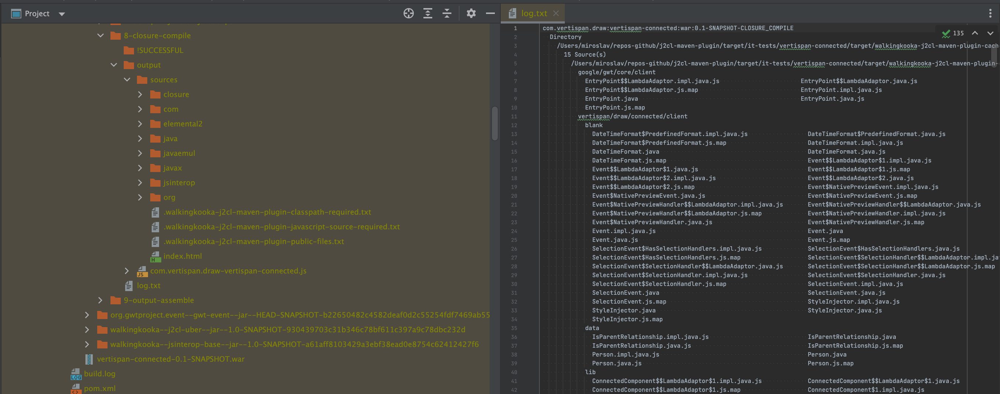

[](https://github.com/mP1/j2cl-maven-plugin/actions/workflows/build.yaml/badge.svg)
[](https://coveralls.io/github/mP1/j2cl-maven-plugin?branch=master)
[](https://opensource.org/licenses/Apache-2.0)
[](https://lgtm.com/projects/g/mP1/j2cl-maven-plugin/context:java)
[](https://lgtm.com/projects/g/mP1/j2cl-maven-plugin/alerts/)
[](https://github.com/mP1/j2cl-central)


J2CL Maven plugin
=================

This plugin is a rewrite of code present in

    https://github.com/Vertispan/j2clmavenplugin
    
For a full list of contributors, read source and to more click [here](https://github.com/Vertispan/j2clmavenplugin/commits/master)    

A major difference between the two is this plugin requires most parameters and dependencies to be declared as Maven
artifacts, nothing is assumed, everything must be declared in the pom in some form. As much as possible nothing is
defaulted and must be present in the POM.


# Usage

The preferred way to use the plugin is to checkout the source

```bash
git clone git://github.com/mP1/j2cl-maven-plugin.git
```

and build and install with Maven.

```bash
mvn clean install
```

## Maven

Note this plugin has issues working with [Maven 3.8.3](https://github.com/mP1/j2cl-maven-plugin/issues/444), the recommended
version to use is Maven 3.6.3.


# Goals

The plugin supports three out of the four following goals

1. `build`: executes a single compilation, typically to produce a JS application or library.

2. `clean`: cleans up all the cache directory.

3. `test`: executes junit 3 tests.

4. 'watch': aka DEVMODE TODO

Some pieces of the `vertispan/j2clmavenplugin` are currently missing:

- DevMode: Should not be too hard to watch the source directory and re-build.


# Annotation processors

Dependencies with an annotation processor are automatically detected as annotation processors and "run". Note these
archives must not have any java source or javascript as it will always be ignored and never transpiled. The annotation
and additional source must be in a separate archive and should be a dependency.


# Super sourcing

The Google Web Tookit (GWT) provides a feature to allow two definitions of a java file to exist. One will be a compiled
by javac and used in a regular JRE environment, the second will become the alternate which will be translated to javascript.
A different alternative is to use shading which is mentioned below in the `Shade` section.


# Dependencies declaration

The `vertispan/j2clmavenplugin` assumes some core dependencies are implied with defaults, meaning these dependencies are
not present in any form in the POM. This plugin requires that every single dependency be eventually declared directly
by the parent project or its dependencies eventually declare them in their respective POMs. This tries to keep faithful,
to how regular Maven java projects work and satisfy their dependencies.

A sample POM with the minimal dependencies and this plugin declaration is present as `sample.pom.xml`.

As a guide the following dependencies below may be considered a minimal requirement, and these were the implied or default
dependencies that were defaulted.


## Plugin Repositories

Sample required plugin repositories

```xml
<pluginRepositories>
    <pluginRepository>
        <id>github-mp1-appengine-repo</id>
        <url>https://maven-repo-254709.appspot.com</url>
    </pluginRepository>

    <pluginRepository>
        <id>google-snapshots</id>
        <name>google-snapshots</name>
        <url>https://oss.sonatype.org/content/repositories/google-snapshots/</url>
        <releases>
            <enabled>true</enabled>
        </releases>
        <snapshots>
            <enabled>true</enabled>
        </snapshots>
    </pluginRepository>

    <pluginRepository>
        <id>vertispan-releases</id>
        <name>Vertispan hosted artifacts-releases</name>
        <url>https://repo.vertispan.com/j2cl</url>
        <releases>
            <enabled>true</enabled>
        </releases>
        <snapshots>
            <enabled>true</enabled>
        </snapshots>
    </pluginRepository>

    <pluginRepository>
        <id>vertispan-snapshots</id>
        <name>Vertispan Snapshots</name>
        <url>https://repo.vertispan.com/gwt-snapshot/</url>
        <snapshots>
            <enabled>true</enabled>
            <updatePolicy>daily</updatePolicy>
            <checksumPolicy>fail</checksumPolicy>
        </snapshots>
    </pluginRepository>

    <pluginRepository>
        <id>sonatype-snapshots-repo</id>
        <url>https://oss.sonatype.org/content/repositories/snapshots</url>
        <snapshots>
            <enabled>true</enabled>
            <updatePolicy>daily</updatePolicy>
            <checksumPolicy>fail</checksumPolicy>
        </snapshots>
    </pluginRepository>

    <pluginRepository>
        <id>sonatype-repo</id>
        <url>https://oss.sonatype.org/content/repositories/repositories</url>
        <snapshots>
            <enabled>true</enabled>
            <updatePolicy>daily</updatePolicy>
            <checksumPolicy>fail</checksumPolicy>
        </snapshots>
    </pluginRepository>
</pluginRepositories>
```


## Plugin

Sample plugins declaration to use this Maven Plugin. The parameters under the `configuration` are described in further
detail below. This assumes a property has also been defined to match the version in (j2cl-uber)](https://lgtm.com/projects/g/mP1/j2cl-uber)


Plugin definition
```xml
 <plugin>
    <groupId>walkingkooka</groupId>
    <artifactId>j2cl-maven-plugin</artifactId>
    <version>1.0-SNAPSHOT</version>
    <executions>
        <execution>
            <id>build-js</id>
            <phase>prepare-package</phase>
            <goals>
                <goal>build</goal>
            </goals>
            <configuration>
                <classpath-scope>runtime</classpath-scope>
                <!--
                BUNDLE, WHITESPACE_ONLY, SIMPLE, ADVANCED
                -->
                <compilation-level>ADVANCED</compilation-level>
                <defines>
                    <jre.checkedMode>DISABLED</jre.checkedMode>
                    <jre.checks.checkLevel>MINIMAL</jre.checks.checkLevel>
                    <jsinterop.checks>DISABLED</jsinterop.checks>
                </defines>
                <entry-points>example.helloworld.app</entry-points>
                <externs></externs>
                <formatting>
                <!--
                PRETTY_PRINT | PRINT_INPUT_DELIMITER | SINGLE_QUOTES
                -->
                    <param>PRETTY_PRINT</param>
                    <param>PRINT_INPUT_DELIMITER</param>
                    <param>SINGLE_QUOTES</param>
                </formatting>
                <!--
                    ECMASCRIPT3,
                    ECMASCRIPT5,
                    ECMASCRIPT5_STRICT,
                    ECMASCRIPT_2015,
                    ECMASCRIPT_2016,
                    ECMASCRIPT_2017,
                    ECMASCRIPT_2018,
                    ECMASCRIPT_2019,
                    STABLE
                -->
                <language-out>ECMASCRIPT_2016</language-out>
                <!-- when true a sources sub directory will appear below the main javascript -->
                <sourceMaps>sources/</sourceMaps>
                <thread-pool-size>0</thread-pool-size>

                <classpath-required>
                    <param>group-id-1:artifact-id-2:*</param>
                    <param>group-id-1:artifact-id-2:version-3</param>
                </classpath-required>
                <ignored-dependencies/>
                <javascript-source-required/>
            </configuration>
        </execution>
    </executions>
</plugin>
```


## Dependencies

The fragment below contains two uber depdencies that take care of the many minimal dependencies that are required by a j2cl
application and unit tests.

```xml
<dependencies>
    <dependency>
        <groupId>walkingkooka</groupId>
        <artifactId>j2cl-uber</artifactId>
        <version>1.0-SNAPSHOT</version>
    </dependency>

    <dependency>
        <groupId>walkingkooka</groupId>
        <artifactId>j2cl-uber-test</artifactId>
        <version>1.0-SNAPSHOT</version>
        <scope>test</scope>
    </dependency>
</dependencies>
```


# Maven plugin parameters

Many parameters are actually used to tweak and configure the Closure compiler. Refer to the Closure documentation for
more information.


## browser-log-level

This option is only available within tests, and controls which browser console messages are printed after each individual test
(`classpathscope=test`).

- NONE
- DEBUG
- INFO
- WARN
- ERROR
- ALL

```xml
<browser-log-level>ALL</browser-log-level>
```

The sample log below includes some logging both of the report and other logging messages printed during test execution.
```txt
INFO: Detected dialect: W3C
[INFO]           CHROME
[INFO]               Test Report
[INFO]                 j2cl-maven-plugin test runner [PASSED]
[INFO]                 /Users/miroslav/repos-github/j2cl-maven-plugin/target/it-tests/junit-test-browser-log-level/target/walkingkooka-j2cl-maven-plugin-cache/walkingkooka--j2cl-maven-plugin-it-junit-test-browser-log-level--jar--1.0-810114ee72641960e5b4c1b3aa2841a9797586f3/8-closure-compile/output/test.JunitTest.html
[INFO]                 4 of 4 tests run in 3.7200000369921327ms.
[INFO]                 4 passed, 0 failed.
[INFO]                 1 ms/test. 1 files loaded.
[INFO]                  
[INFO]               Browser log
[INFO]                 SEVERE file:///Users/miroslav/repos-github/j2cl-maven-plugin/target/it-tests/junit-test-browser-log-level/target/walkingkooka-j2cl-maven-plugin-cache/walkingkooka--j2cl-maven-plugin-it-junit-test-browser-log-level--jar--1.0-810114ee72641960e5b4c1b3aa2841a9797586f3/8-closure-compile/output/test.JunitTest.js 76:341 "Error message 4!!"
[INFO]                 WARNING file:///Users/miroslav/repos-github/j2cl-maven-plugin/target/it-tests/junit-test-browser-log-level/target/walkingkooka-j2cl-maven-plugin-cache/walkingkooka--j2cl-maven-plugin-it-junit-test-browser-log-level--jar--1.0-810114ee72641960e5b4c1b3aa2841a9797586f3/8-closure-compile/output/test.JunitTest.js 76:448 "Warn message 3!!"
[INFO]             All test(s) successful!
[INFO]   
[INFO]   Log file
[INFO]     /Users/miroslav/repos-github/j2cl-maven-plugin/target/it-tests/junit-test-browser-log-level/target/walkingkooka-j2cl-maven-plugin-cache/walkingkooka--j2cl-maven-plugin-it-junit-test-browser-log-level--jar--1.0-810114ee72641960e5b4c1b3aa2841a9797586f3/9-junit-tests/log.txt
[INFO] 
```


## browsers

A list of browsers that are used by webdriver to execute transpiled unit tests,(`classpathscope=test`). At least
one must be selected out of the supported browsers listed below.

```xml
<browsers>
   <param>CHROME</param>
   <param>FIREFOX</param>
   <param>HTML_UNIT</param>
</browsers>
```

If HTML_UNIT is selected the `language-out` should be set to `ECMASCRIPT5` as newer javascript constructs such as class
are not supported by the html unit javascript engine. 


## classpath-required

A list of artifacts that will be added to all classpaths. The first entry will be used as the bootstrap archive. If a
dependency is present here but absent in `javascript-source-required` then it will never appear when js files are required.

The snippet below is a good starting point and forcibly includes a few minimally required artifacts.

```xml
<classpath-required>
    <param>group-id-1:artifact-id-2:*</param>
    <param>group-id-1:artifact-id-2:version-3</param>
</classpath-required>
```

- Maven coordinates may have a wildcard in the version.


Archives with the following conditions will automatically marked as equivalent to adding a `classpath-required` entry.

- Annotation processors.
- JRE classes (including bootstrap).
- Only annotation class files.
- If the file `.walkingkooka-j2cl-maven-plugin-classpath-required.txt` is present.


## classpath-scope

The suggested value is typically `compile`, for more info click [here](https://maven.apache.org/guides/introduction/introduction-to-dependency-mechanism.html)

```xml
<classpath-scope>compile</classpath-scope>
```


## compilation-level

A closure compiler parameter that controls the compilation process, for more info click [here](https://developers.google.com/closure/compiler/docs/compilation_levels#enable-app). 
The Closure Compiler lets you choose from three levels of compilation, ranging from simple removal of whitespace and comments to aggressive code transformations.

```xml
<compilation-level>ADVANCED</compilation-level>
```


## defines

These key value pairs are arguments given only to the Closure compiler. The fragment below is the recommended.

```xml
<defines>
    <jre.checkedMode>DISABLED</jre.checkedMode>
    <jre.checks.checkLevel>MINIMAL</jre.checks.checkLevel>
    <jsinterop.checks>DISABLED</jsinterop.checks>
</defines>
```


## entry-points

A Closure compiler argument containing one or more entry point(s) (`classpathscope=compile`).

```xml
<entrypoint>helloworld.app</entrypoint>
```


## externs

Key value pairs that define externs for the Closure compiler. For more info click [here](https://developers.google.com/closure/compiler/docs/api-tutorial3#externs).


## formatting

Zero or many formatting options that may be used to aide troubleshooting, or simply to produce pretty printed output.
The sample below shows all available formatting options, some or all may be removed as necessary.

For more info click [here](http://googleclosure.blogspot.com/2010/10/pretty-print-javascript-with-closure.html)

```xml
<formatting>
    <param>PRETTY_PRINT</param>
    <param>PRINT_INPUT_DELIMITER</param>
    <param>SINGLE_QUOTES</param>
</formatting>
```


## ignored-dependencies

A list of artifacts that will not be processed. This is used to avoid processing any bootstrap and jre artifacts, 
as they come pre-processed, or only contain annotations that are not required during transpiling (j2cl) but necessary
for compiling (javac).

```xml
<ignored-dependencies>
    <!-- dependencies below only contain annotations -->
    <param>group1:artifact2:*</param>
    <param>group1:artifact2:version3</param>
</ignored-dependencies>
```

- Maven coordinates may have a wildcard in the version.


Archives with the following conditions will automatically marked as equivalent to adding a `ignored-dependencies` entry.

- Annotation processors.
- Dependency where `classifier=sources` pairs another dependency.
- JRE classes & javascript (including bootstrap).
- Only annotation class files.
- If the file `.walkingkooka-j2cl-maven-plugin-ignored-dependency.txt` is present.

## initial-script-filename

The path to the initial script filename (`classpathscope=compile`).


## javascript-source-required

A list of artifacts that will be added to when javascript sources are being processed. If a dependency is present here
but absent in `classpath-required` then it will never appear on a classpath.

The bootstrap and jre artifacts mentioned below are the transpiled versions of similar artifacts that appear in `<classpath-required`,
and the later includes numerous classes and mostly annotations that provide hints to the transpilation process.

The snippet below is a good starting point and forcibly includes a few minimally required artifacts.

```xml
<javascript-source-required>
    <param>group1:artifact2:filetype3:classifier4:version5</param>
</javascript-source-required>
```

- Maven coordinates may have a wildcard in the version.


Archives with the following conditions will automatically marked as equivalent to adding a `javascript-source-required` entry.

- Archives with only JRE javascript (including bootstrap).


## java-compiler-arguments

This may be used to pass additional arguments to javac such as an annotation processor argument.

```xml
<java-compiler-arguments>
    <param>-Aannotation-processor-argument=value</param>
</java-compiler-arguments>
```


## language-out

The output language of the resulting javascript.

For a detailed list of available language out options click [here](https://github.com/google/closure-compiler/wiki/Flags-and-Options).

The xml snippet below includes all currently available options, only one may be set, more than one is an error.

```xml
<language-out>ECMASCRIPT3</language-out>
<language-out>ECMASCRIPT5</language-out>
<language-out>ECMASCRIPT5_STRICT</language-out>
<language-out>ECMASCRIPT_2015</language-out>
<language-out>ECMASCRIPT_2016</language-out>
<language-out>ECMASCRIPT_2017</language-out>
<language-out>ECMASCRIPT_2018</language-out>
<language-out>ECMASCRIPT_2019</language-out>
```


## output
This path is the final location of the final javascript (`classpathscope=compile`).


## source-maps

Accepts a relative path to the target of directory `initial-script-filename` where source files will be copied. This will
typically be a sub directory perhaps called `sources` under the same directory receiving the main javascript output file.
Click [here](https://developer.mozilla.org/en-US/docs/Tools/Debugger/How_to/Use_a_source_map) for more details about `.map`
files and how source maps work.

```xml
<source-maps>sources/</source-maps>
```


## skip-tests

This is only available when executing tests, and provides an easy switch to turn tests on/off (`classpathscope=test`).
```xml
<skip-tests>false</skip-tests>
```


## tests

A block of multiple `test` entries each defining a GLOB pattern to match test suites class names (`classpathscope=test`).

```xml
<tests>
    <test>org.gwtproject.timer.client.TimerJc2lTest</test>
    <test>org.gwtproject.timer.client2.**</test>
</tests>
```


## test-timeout

The timeout for each test not the entire suite in seconds (`classpathscope=test`).

```xml
<test-timeout>60</test-timeout>
```


## thread-pool-size

This parameter controls size of the thread pool used to execute parallel dependency processing. A value of 0, uses the
CPU core * 2, a value of 1 is useful to limit a single task at a time which makes for uninterrupted console messages at the
cost of longer build times.

```xml
<thread-pool-size>0</thread-pool-size>
```


# Special files


## Classpath required file(s)

A dependency archive with a `.walkingkooka-j2cl-maven-plugin-classpath-required.txt` file in its root is equivalent to
adding an `classpath-required` entry to the plugin pom.


## Ignored dependency file(s)

A dependency archive with a `.walkingkooka-j2cl-maven-plugin-ignored-dependency.txt` file in its root is equivalent to
adding an `ignored-dependency` entry to the plugin pom.


## Ignored file(s)

A facility that is almost identical to `.gitignore` files is also supported and honoured when source files are processed.
If a `.walkingkooka-j2cl-maven-plugin-ignored-files.txt` is present in a source directory all patterns within it are honoured
for the current and sub directories.

The actual patterns are PathMatcher [glob patterns](https://docs.oracle.com/javase/tutorial/essential/io/fileOps.html#glob)
without the leading `glob:` prefix.

- Blank lines are ignored
- Lines beginning with HASH are considered to be comments and are ignored.
- All other lines are used to build a glob pattern, using the java snippet directly below
- No support is provided for escaping of any sort.


### Processing

Files are ignored before the Google preprocessor attempts to remove classes and class members are annotated with `@Gwt-Incompatible`.


### Sample .walkingkooka-j2cl-maven-plugin-ignored-files.txt

```text
# This is a comment and ignored. The two blank lines are also ignored.


# The two patterns will ignore files in this and any sub directories.
IgnoredFile1.*
sub2/IgnoredFile2.*
``` 


## Javascript source required file(s)

A dependency archive with a `.walkingkooka-j2cl-maven-plugin-javascript-source-required.txt` file in its root is equivalent to
adding an `javascript-source-required` entry to the plugin pom.


# Shade file(s)

The shade file is useful for shading classes belonging to package and all sub packages. This useful feature helps when
developing missing or incoplete JRE classes such as `java.util.Base64`. This feature supports the ability to create
a replacement under a different package allowing regular JRE unit tests to be written that compare results when invoking
the real `java.util.Base64` and a class with similar methods but under a different package.


 
## Sample .walkingkooka-j2cl-maven-plugin-shade.txt

The properties file content. This example will eventually change packages starting with `example.java.util` to `java.util`.

```txt
example.java.util=java.util
```

Note that java source and their matching class files are both shaded using the same rules.

The sample below shows an example of the source before step 5, after that completes, the package and type references
will have the example removed.

```java
package example.java.util;

class Base64 {
  class Decoder {
    
  }

  class Encoder {
  
  }
}
```

The source after step 5 processing.
```java
package java.util;

class Base64 {
  class Decoder {
    
  }

  class Encoder {
  
  }
}
```


# Building steps or phases.

The build process involves transforming the parent project and dependencies including transitives from java into javascript,
in reverse order. Reverse order here means that if the project is the root of the dependency tree, then for all
operations to complete successfully dependencies that are leaves of this tree must be processed first. Once the leaves
are completed successfully dependencies or the project only requiring them can be attempted. Eventually the only
outstanding artifact or dependency is the project itself.

The plugin will create a separate directory for each artifact, using the maven coordinates and a HASH of all dependencies.
This means any time a dependency changes for any reason, any artifacts that reference it will also change and they will
be processed once more which is the desired so that changes are included in the final output. Processing a single dependency
potentially involves numerous steps, as each is performed a directory which includes a number prefix is created. These sub
directories will include a log file including all output for that step along with further files and directories. These logs
will be useful if anything goes wrong.

Every single step for every single artifact will have its own log file under its own step directory under the directory
for that artifact named according to the scheme mentioned above.

Note that the directory for each step will only include an empty directory indicating the status or outcome of that particular
step. Possible outcomes include

- !ABORTED
- !FAILED
- !SKIPPED
- !SUCCESSFUL

These are useful as a quick mechanism to find the individual failing step, with the `log.txt` containing further details.


## Step 0 Hashing

The first step whenever a dependency processing begins is to compute the hash which is then combined with the maven
coordinates and used to create a directory if one did not previously exist.


### hash.txt

The hash step directory will also include a `hash.txt` file which contains all the items used to produce the hash.
The contents are also useful as a reference to discover which other dependencies were required by this particular dependency,
note the order of this listing matches the order dependencies are declared in the POM in a depth first ordering.

```txt
compile-source-root: annotations
compile-source-root: java
define: jre.checkedMode=DISABLED
define: jre.checks.checkLevel=MINIMAL
define: jsinterop.checks=DISABLED
dependencies-0: walkingkooka:j2cl-uber:jar:1.0-SNAPSHOT
dependencies-1: walkingkooka:j2cl-jre-java:jar:1.0-SNAPSHOT
dependencies-2: com.google.jsinterop:jsinterop-annotations:jar:2.0.0
dependencies-3: walkingkooka:j2cl-gwt-internal-annotations:jar:1.0-SNAPSHOT
dependencies-4: walkingkooka:jsinterop-base:jar:1.0-SNAPSHOT
dependencies-5: walkingkooka:j2cl-javac-bootstrap-classpath:jar:1.0-SNAPSHOT
dependencies-6: walkingkooka:j2cl-jre-javascript:jar:1.0-SNAPSHOT
dependencies-7: walkingkooka:j2cl-bootstrap-javascript:jar:jszip:1.0-SNAPSHOT
entry-points: app.app
formatting: PRETTY_PRINT
initial-script-filename: /Users/miroslav/repos-github/j2cl-maven-plugin/target/it-tests/formatting-pretty-print/target/j2cl-maven-plugin-it-formatting-pretty-print-1.0/walkingkooka-j2cl-maven-plugin-it-formatting-pretty-print.js
language-out: ECMASCRIPT5
level: ADVANCED_OPTIMIZATIONS
scope: RUNTIME
sources-kind: SRC
```


## Step 1 Unpack

An attempt will be made to locate the sources jar and unpack if found. If no java source files (`*.java`) are found the
original artifact itself will be unpacked over the first unpack. If no java source files are found in either the remaining
steps will be aborted, otherwise the next step will be attemped trying to eventually transpile the unpacked java to
javascript.


## Step 2 Javac Compile

The source extracted in step 2 will then be compiled by javac.


## Step 3 Gwt incompatible stripped source

The goal of this step is to remove classes and class members such as methods or fields that have been marked with the
`@Gwt-incompatible` annotation with the "output" directory of this step containing the final result AFTER these classes and
members have been removed. Most of this work is done by the Google `JavaPreprocessor`.

This step also removes entire classes that have been matched by the ignore files mentioned above.


## Step 4 Javac Compile Gwt incompatible stripped source

This step invokes javac on the output produced by step 4.


## Step 5 shade java source.

This step will execute if a `.walkingkooka-j2cl-maven-plugin-shade.txt` file is present. All the mapped java source files
will be shaded so they appear in the new package. 


## Step 6 shade classfiles.

This step will execute if a `.walkingkooka-j2cl-maven-plugin-shade.txt` file is present. All the mapped class files
will be shaded so they appear in the new package. The files modified here will be the class files of the java source
modified in step 5.


## Step 7 Transpile 

This step accepts the output from step 4 and transpile that java source into javascript.


## Step 8 Closure compile

This is the final step and only run for the project, it uses the Closure compiler to produce the final javascript file(s).


# Troubleshooting

A build results in all required dependencies as necessary creating a directory under the cache directory formed from
the artifact coords along with a hash of various attributes and dependencies. The content that appears in each of these
logs are is also printed to the console but with multiple threads running concurrently it might be confusing with interleved messages.
It might also be useful to set the `threadpool-size=1` so messages are not mixed up with multiple threads writing output.

`../walkingkooka-j2cl-maven-plugin-cache/walkingkooka--j2cl-maven-plugin-it-junit-test--jar--1.0-db1ecd80f01db349f97454549ba798c71e4283fb`

All the steps for each artifact are also given a directory and log with all debug statements. Each log file will only
contain output for the owning step, concurrent steps produce independent log files. 


## log.txt

Each component will include several of the steps mentioned in the previous section, and a log file will be present
with messages and other output concerning that particular step.

```txt
walkingkooka:j2cl-maven-plugin-it-junit-test:jar:1.0-TRANSPILE
  Directory
    /Users/miroslav/repos-github/88j2cl-maven-plugin/target/it-tests/junit-test/target/walkingkooka-j2cl-maven-plugin-cache/walkingkooka--j2cl-maven-plugin-it-junit-test--jar--1.0-db1ecd80f01db349f97454549ba798c71e4283fb/7-transpiled-java-to-javascript
      Preparing...
      Source path(s)
        /Users/miroslav/repos-github/88j2cl-maven-plugin/target/it-tests/junit-test/target/walkingkooka-j2cl-maven-plugin-cache/walkingkooka--j2cl-maven-plugin-it-junit-test--jar--1.0-db1ecd80f01db349f97454549ba798c71e4283fb/3-gwt-incompatible-stripped-source/output
      J2clTranspiler
        Parameters
          Classpath(s)
              /Users/miroslav/repos-github/88j2cl-maven-plugin/target/it-repo/com/google/jsinterop/jsinterop-annotations/2.0.0/jsinterop-annotations-2.0.0.jar
              /Users/miroslav/repos-github/88j2cl-maven-plugin/target/it-repo/walkingkooka/j2cl-bootstrap-javascript/1.0-SNAPSHOT/j2cl-bootstrap-javascript-1.0-SNAPSHOT-jszip.jar
              /Users/miroslav/repos-github/88j2cl-maven-plugin/target/it-repo/walkingkooka/j2cl-gwt-internal-annotations/1.0-SNAPSHOT/j2cl-gwt-internal-annotations-1.0-SNAPSHOT.jar
              /Users/miroslav/repos-github/88j2cl-maven-plugin/target/it-repo/walkingkooka/j2cl-javac-bootstrap-classpath/1.0-SNAPSHOT/j2cl-javac-bootstrap-classpath-1.0-SNAPSHOT.jar
              /Users/miroslav/repos-github/88j2cl-maven-plugin/target/it-repo/walkingkooka/j2cl-jre-java/1.0-SNAPSHOT/j2cl-jre-java-1.0-SNAPSHOT.jar
              /Users/miroslav/repos-github/88j2cl-maven-plugin/target/it-repo/walkingkooka/j2cl-jre-javascript/1.0-SNAPSHOT/j2cl-jre-javascript-1.0-SNAPSHOT.jar
              /Users/miroslav/repos-github/88j2cl-maven-plugin/target/it-repo/walkingkooka/j2cl-junit-annotations/1.0-SNAPSHOT/j2cl-junit-annotations-1.0-SNAPSHOT.jar
              /Users/miroslav/repos-github/88j2cl-maven-plugin/target/it-repo/walkingkooka/j2cl-junit-java/1.0-SNAPSHOT/j2cl-junit-java-1.0-SNAPSHOT.jar
              /Users/miroslav/repos-github/88j2cl-maven-plugin/target/it-tests/junit-test/target/walkingkooka-j2cl-maven-plugin-cache/walkingkooka--j2cl-junit-javascript--jar--1.0-SNAPSHOT-69164038504dad959653fbc60320aade26f8e7a7/4-javac-gwt-incompatible-stripped-source/output
              /Users/miroslav/repos-github/88j2cl-maven-plugin/target/it-repo/walkingkooka/j2cl-junit-processor/1.0-SNAPSHOT/j2cl-junit-processor-1.0-SNAPSHOT.jar
              /Users/miroslav/repos-github/88j2cl-maven-plugin/target/it-tests/junit-test/target/walkingkooka-j2cl-maven-plugin-cache/walkingkooka--jsinterop-base--jar--1.0-SNAPSHOT-564fba3536a58e77c2eb8a64b36c82064c1711a8/4-javac-gwt-incompatible-stripped-source/output
            11 file(s)
          *.java Source(s)
              /Users/miroslav/repos-github/88j2cl-maven-plugin/target/it-tests/junit-test/target/walkingkooka-j2cl-maven-plugin-cache/walkingkooka--j2cl-maven-plugin-it-junit-test--jar--1.0-db1ecd80f01db349f97454549ba798c71e4283fb/3-gwt-incompatible-stripped-source/output
                javatests/test
                  JunitTest_Adapter.java
                test
                  JunitTest.java                                               StringValue.java
            3 file(s)
          *.native.js source(s)
            0 file(s)
          *.js source(s)
              /Users/miroslav/repos-github/88j2cl-maven-plugin/target/it-tests/junit-test/target/walkingkooka-j2cl-maven-plugin-cache/walkingkooka--j2cl-maven-plugin-it-junit-test--jar--1.0-db1ecd80f01db349f97454549ba798c71e4283fb/3-gwt-incompatible-stripped-source/output/javatests/test
                JunitTest_AdapterSuite.js
            1 file(s)
          Output
            /Users/miroslav/repos-github/88j2cl-maven-plugin/target/it-tests/junit-test/target/walkingkooka-j2cl-maven-plugin-cache/walkingkooka--j2cl-maven-plugin-it-junit-test--jar--1.0-db1ecd80f01db349f97454549ba798c71e4283fb/7-transpiled-java-to-javascript/output
        J2clTranspiler
          0 Error(s)
          0 Warnings(s)
          0 Message(s)
          Copy js to output
              /Users/miroslav/repos-github/88j2cl-maven-plugin/target/it-tests/junit-test/target/walkingkooka-j2cl-maven-plugin-cache/walkingkooka--j2cl-maven-plugin-it-junit-test--jar--1.0-db1ecd80f01db349f97454549ba798c71e4283fb/7-transpiled-java-to-javascript/output/javatests/test
                JunitTest_AdapterSuite.js
            1 file(s)
          Output file(s) after copy
              /Users/miroslav/repos-github/88j2cl-maven-plugin/target/it-tests/junit-test/target/walkingkooka-j2cl-maven-plugin-cache/walkingkooka--j2cl-maven-plugin-it-junit-test--jar--1.0-db1ecd80f01db349f97454549ba798c71e4283fb/7-transpiled-java-to-javascript/output
                javatests/test
                  JunitTest_Adapter$GoogTestCase$$Overlay.impl.java.js         JunitTest_Adapter$GoogTestCase$$Overlay.java.js
                  JunitTest_Adapter$GoogTestCase$$Overlay.js.map               JunitTest_Adapter$IThenable$$Overlay.impl.java.js
                  JunitTest_Adapter$IThenable$$Overlay.java.js                 JunitTest_Adapter$IThenable$$Overlay.js.map
                  JunitTest_Adapter.impl.java.js                               JunitTest_Adapter.java
                  JunitTest_Adapter.java.js                                    JunitTest_Adapter.js.map
                  JunitTest_AdapterSuite.js
                test
                  JunitTest.impl.java.js                                       JunitTest.java
                  JunitTest.java.js                                            JunitTest.js.map
                  StringValue.impl.java.js                                     StringValue.java
                  StringValue.java.js                                          StringValue.js.map
            19 file(s)
    
    Log file
      /Users/miroslav/repos-github/88j2cl-maven-plugin/target/it-tests/junit-test/target/walkingkooka-j2cl-maven-plugin-cache/walkingkooka--j2cl-maven-plugin-it-junit-test--jar--1.0-db1ecd80f01db349f97454549ba798c71e4283fb/7-transpiled-java-to-javascript/log.txt
```


# Cache directory tree structure view

The image below contains two panel views, the left shows a directory tree showing the output directory showing all artifacts
and some log files expanded, and the right shows a sample log file. The log shows a successful Closure compile build, with
numerous warning level messages. All the parameters and paths to files are above the area of the log shown.



 


# Samples

Samples of all the various files mentioned above are available under [samples](samples/)


# Contributions

Suggestions via the issue tracker, and pull requests are most welcomed.
